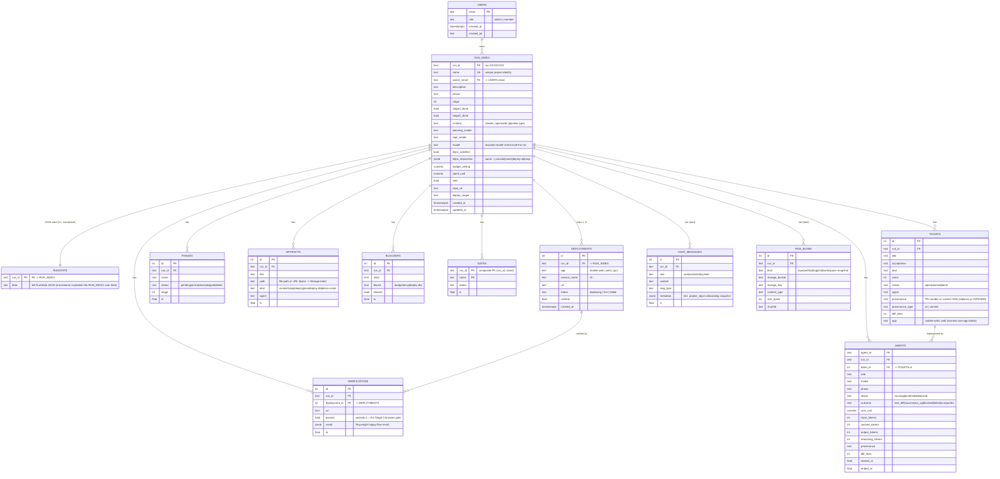

# Console Schema — ERD & reference

Single source-of-truth schema reference for the console datastore and the FastAPI/DB rebuild target.

**The visual ERD source of truth is [`schema-erd.svg`](schema-erd.svg)** — edit the SVG when the
relational shape changes. The mermaid diagram below mirrors it for diff-friendly review, and the
"Schema reference (detail)" section carries the table-by-table DDL, constraints, storage decisions,
and API access patterns. Service/storage topology is in [`service-architecture.svg`](service-architecture.svg);
the current-state runtime architecture is in [`ARCHITECTURE.md`](ARCHITECTURE.md).

> **Note on the current production model:** today the per-run tables (`runstate`, `phases`, `artifacts`,
> `blockers`, `gates`, `verifications`, `tickets`, `agents`) live in a **separate Postgres schema per run**
> (`sf_run_<id>`), so the `run_id` relationships below are *logical / enforced per-run*, not cross-schema
> FKs. The ERD shows the **flat, FK'd target** the rebuild moves toward (`run_index` as the central run
> entity, `provenance` replacing the `pr INTEGER` hazard, `chat_messages`/`run_blobs` as later passes).



## ASCII quick view (relationships)

```
USERS (email PK)
  └─owns─< RUN_INDEX (run_id PK, name UK, owner_email FK)        ── the run/project entity
              ├─1:1─ RUNSTATE (run_id PK)                          ── RunState JSON (transitional)
              ├──< DEPLOYMENTS (run_id FK) ──< VERIFICATIONS (deployment_id FK)
              ├──< PHASES
              ├──< ARTIFACTS     (run_id FK)   path only; bytes → Storage (RUN_BLOBS) later
              ├──< BLOCKERS
              ├──< GATES         (run_id+name PK)
              ├──< VERIFICATIONS (run_id FK)   passed=1 ⇒ done gate per deployment
              ├──< TICKETS       (run_id FK) ──< AGENTS (ticket_id FK)
              ├──< AGENTS        (run_id FK)
              ├──< CHAT_MESSAGES (run_id FK)   [later pass — today chat.jsonl]
              └──< RUN_BLOBS     (run_id FK)   [later pass — Supabase Storage manifest]

legend:  ──<  one-to-many      1:1  one-to-one      PK primary  UK unique  FK foreign key
```

## Notes
- `USERS` + `RUN_INDEX` (+ registry) are **global** (`public` schema). The detail tables are per-run
  today (schema-per-run); the rebuild keeps that routing in `dbshim` for v1 while `RUN_INDEX` becomes the
  flat, queryable index (owner filter + unique name as real constraints).
- `deploy_url` is **not** a scalar on `RUN_INDEX`; deliverable URLs live in `DEPLOYMENTS` (1..N per run),
  and `VERIFICATIONS` is per-deployment.
- `pipeline type` = `RUN_INDEX.runtime` (`claude` | `opencode`). The resolved model is stored in `RUN_INDEX.model`
  (claude/opencode model id) so a run records exactly what built it.
- `provenance`/`provenance_type` on `TICKETS`/`AGENTS` replace the `pr INTEGER` column (the Postgres
  commit-SHA bug). `app` on `TICKETS` is new for the harness's mobile-web + web two-app builds.
- `CHAT_MESSAGES` and `RUN_BLOBS` are **later passes** (chat is `chat.jsonl`; files/logs are on the
  `/data` volume today) — shown dashed-in for the end-state.

---

# Schema reference (detail)

_Folded from the former root `schema.md` (now removed). The ERD above and `schema-erd.svg` are the
source of truth for table shape; this section carries DDL, constraints, storage, and API detail._

## Current Decisions

- First FastAPI pass should replace the HTTP shell while keeping `dbshim`, per-run schemas, and the current store classes as repositories.
- Add `public.run_index` in the first FastAPI/storage pass. It removes the current N-schema scan for `/api/runs` and gives project names and owners real indexed database shape.
- Fix `tickets.pr` and `agents.pr` provenance typing as a standalone high-priority storage fix before relying on opencode/Kimi runs in Postgres.
- Keep chat JSONL, logs, uploads, and artifact bytes file-backed for the first FastAPI cut; move them to DB/Storage later.
- Project creation chat now records the onboarding input snapshot in `chat.jsonl`: prompt, project/runtime/model metadata, input documents/images, and AI responses.

## Goals

- Preserve the current pipeline semantics while the HTTP layer moves to FastAPI.
- Make ownership, status, graph, chat, logs, artifacts, and budget state explicit enough for typed route handlers.
- Keep local development hermetic with SQLite where possible.
- Keep production on the existing Supabase/Postgres project: `software-factory-as-a-skill`.
- Do not create new Supabase projects.

## Current Storage Topology

The console does not use one flat relational schema today.

- Global tables live in `public`.
- Each run gets its own schema in Postgres: `sf_run_<run_id_suffix>`.
- In local/dev mode, the same per-run tables live in `<runs_dir>/<run_id>/run.db`.
- Large or stream-like data is still file-backed under `<runs_dir>/<run_id>/`.

Current code references:

- `src/software_factory/dbshim.py` - SQLite/Postgres routing and per-run schema creation.
- `src/software_factory/db.py` - runstate, phases, artifacts, blockers, gates, verifications.
- `src/software_factory/tickets.py` - tickets.
- `src/software_factory/agents.py` - agent telemetry.
- `src/software_factory/users.py` - global user directory.
- `src/software_factory/chat_store.py` - file-backed chat JSONL.
- `console/server.py` - HTTP route access patterns.

## Production Database

Use the Tenexity Supabase project named `software-factory-as-a-skill`.

Current coordination says:

- Current live DB: `software-factory-state` in the personal org.
- Intended DB: `software-factory-as-a-skill` in the Tenexity org.
- The cutover is not live yet.
- Do not delete the old DB until cutover and verification are complete.

## Current Global Tables

### `public.sf_runs`

Purpose: registry for run discovery in Postgres mode.

Created by `dbshim.PgConn._ensure()`.

```sql
create table if not exists public.sf_runs (
  run_id text primary key,
  schema_name text not null,
  created_at timestamptz not null default now()
);
```

Notes:

- Only strict run ids matching `run-[0-9a-f]{8}` are registered.
- The registry protects discovery from volume debris and bad CLI argument order.
- FastAPI should continue to treat this table as the canonical run index in Postgres mode.

Recommended additions:

```sql
create unique index if not exists sf_runs_schema_name_key
  on public.sf_runs (schema_name);

create index if not exists sf_runs_created_at_idx
  on public.sf_runs (created_at desc);
```

### `public.users`

Purpose: console team directory and role lookup.

Created by `UserStore._ensure()`.

```sql
create table if not exists public.users (
  email text primary key,
  role text not null default 'member',
  created_at timestamptz default now(),
  created_by text
);
```

Current roles:

- `admin`
- `member`

Recommended target form:

```sql
create table if not exists public.users (
  email text primary key,
  role text not null check (role in ('admin', 'member')),
  created_at timestamptz not null default now(),
  created_by text
);
```

Security note:

- `public.users` is in the Supabase exposed `public` schema.
- If the Data API exposes this table, enable RLS and keep policies tight, or revoke anon/authenticated access and use only the server connection.
- The console server should remain the authorization boundary. Do not rely on user-editable metadata for roles.

## Current Per-Run Schema

For `run-1234abcd`, the schema name is:

```text
sf_run_1234abcd
```

All per-run queries in Postgres mode rely on per-statement:

```sql
set local search_path to "<run_schema>", public;
```

This is load-bearing because the Supabase transaction pooler does not preserve session state between statements.

### `runstate`

Purpose: resumable orchestration state as JSON.

```sql
create table if not exists runstate (
  run_id text primary key,
  data text not null
);
```

Current JSON keys from `RunState`:

| Key | Type | Notes |
|---|---|---|
| `run_id` | string | Authoritative id. |
| `phase` | string | Terminal state uses `done` or `stopped`; active phase is derived elsewhere. |
| `spent_usd` | number | Persisted fallback; run.log-derived spend usually leads. |
| `repo_url` | string/null | Legacy or fallback repo URL. |
| `deploy_url` | string/null | Final passing verification URL. |
| `skill` | string/null | Expected `software-factory`. |
| `skill_version` | string/null | Current `0.0.1`. |
| `description` | string/null | Original product request. |
| `name` | string | User-facing project name, unique by convention in app code. |
| `deploy_target` | string/null | Usually `railway`. |
| `creds_provided` | string[] | Credential names only, never values. |
| `stage` | integer | Current stage number. |
| `stage1_done` | boolean | Host-owned gate result. |
| `stage2_done` | boolean | Host-owned gate result. |
| `runtime` | string | `claude` or `opencode`, pinned at run start. |
| `planning_model` | string | Optional operator pick for stages 1 and 2. |
| `impl_model` | string | Optional operator pick for stage 3. |
| `deps_required` | string[] | Parsed from architecture artifact. |
| `deps_provided` | string[] | Dependency names only, never values. |
| `deps_satisfied` | boolean | Whether stage 3 may launch. |
| `deps_disposition` | object | name -> `provide`, `mock`, `mcp`, `deploy-db`, legacy `env`. |
| `budget_ceiling` | number/null | Per-run budget override. |
| `held` | boolean | Gated run: visible but not launched. |
| `owner` | string | Creator email, lowercased. Empty means admin-only legacy run. |

Target recommendation:

- Keep `runstate.data` during the FastAPI conversion to avoid breaking stage agents and CLI writes.
- Add typed projection columns in `public.run_index` in the first FastAPI/storage pass.
- Do not split every JSON key into columns in the first FastAPI pass. That would couple the migration to orchestration semantics and make rollback harder.

Minimal typed projection for the first pass:

```sql
create table if not exists public.run_index (
  run_id text primary key references public.sf_runs(run_id) on delete cascade,
  schema_name text not null unique,
  name text not null default '',
  owner text not null default '',
  description text,
  phase text not null default 'provision',
  stage integer not null default 1,
  runtime text not null default 'claude',
  planning_model text,
  impl_model text,
  model text,                                    -- resolved model that built the run (claude/opencode id)
  deploy_target text,
  repo_url text,
  spent_usd double precision not null default 0,
  budget_ceiling double precision,
  held boolean not null default false,
  stage1_done boolean not null default false,
  stage2_done boolean not null default false,
  deps_satisfied boolean not null default false,
  created_at timestamptz not null default now(),
  updated_at timestamptz not null default now()
);

create index if not exists run_index_owner_updated_idx
  on public.run_index (owner, updated_at desc);

create index if not exists run_index_updated_idx
  on public.run_index (updated_at desc);

create unique index if not exists run_index_name_unique_idx
  on public.run_index (lower(name))
  where name <> '';
```

Write-through rule:

- `RunState.save()` or its repository wrapper should update `public.run_index` whenever indexed fields change.
- `public.sf_runs` remains the registry and schema-name source of truth.
- `public.run_index` becomes the list/filter/ownership projection for FastAPI.
- Empty legacy names must remain allowed; uniqueness applies only to non-empty names.
- **A run is not tied to a single `deploy_url`.** Deliverable URLs live in `public.deployments` (1..N per run);
  `run_index` keeps only the high-level `deploy_target` platform.
- `runtime` is the pipeline type (`claude` | `opencode`). Store the resolved `model` as well so a run records exactly what built it.

Reason:

- Current `list_runs()` opens every run schema and JSON-decodes `runstate` to render `/api/runs`.
- Current project-name uniqueness is a racy Python scan.
- Current ownership filtering also requires loading per-run JSON.
- A projection table turns these into indexed reads while preserving the existing per-run state contract.

### `phases`

Purpose: append-only phase hints from host and stage agents.

```sql
create table if not exists phases (
  id integer primary key generated by default as identity,
  name text not null,
  status text not null default 'active',
  stage integer,
  ts double precision not null
);
```

Current behavior:

- Phase rows are hints.
- `Console.derive_phases()` computes the display truth from phases plus artifacts, tickets, agents, verifications, and stage flags.

Recommended constraints:

```sql
alter table phases
  add constraint phases_status_check
  check (status in ('pending', 'active', 'done', 'skipped', 'failed', 'started'));

create index if not exists phases_ts_idx on phases (ts, id);
create index if not exists phases_name_ts_idx on phases (name, ts desc);
```

### `artifacts`

Purpose: artifact metadata, not artifact bytes.

```sql
create table if not exists artifacts (
  id integer primary key generated by default as identity,
  title text,
  path text,
  kind text,
  agent text,
  ts double precision not null
);
```

Common `kind` values:

- `context`
- `repo`
- `deploy`
- `plan`
- `deploy-db`
- `demo-creds`

Current behavior:

- `path` may be a relative file path under the run base/workspace or an external URL.
- File existence is checked at read/projection time.
- Artifact bytes remain on the run volume today.

Recommended additions:

```sql
create index if not exists artifacts_kind_idx on artifacts (kind);
create index if not exists artifacts_agent_idx on artifacts (agent);
create index if not exists artifacts_ts_idx on artifacts (ts);
```

Target direction:

- Keep metadata in `artifacts`.
- Move bytes to Supabase Storage later.
- Add storage locator fields only when the storage adapter exists:
  - `storage_bucket`
  - `storage_key`
  - `content_type`
  - `size_bytes`
  - `sha256`

### `blockers`

Purpose: active and cleared blockers, including budget stops and MCP/deploy-db failures.

```sql
create table if not exists blockers (
  id integer primary key generated by default as identity,
  what text,
  blocks text,
  cleared integer not null default 0,
  ts double precision not null
);
```

Known `blocks` values:

- Pipeline phases such as `build`, `deploy`, `test`
- Cross-cutting blockers such as `budget`, `mcp`, `deploy-db`

Recommended target form:

```sql
create table if not exists blockers (
  id integer primary key generated by default as identity,
  what text not null,
  blocks text,
  cleared boolean not null default false,
  ts double precision not null
);
```

Recommended indexes:

```sql
create index if not exists blockers_open_idx on blockers (cleared, blocks, ts desc);
```

### `gates`

Purpose: named gate status. Mostly legacy/pending-review support; stage completion gates are primarily host-derived.

```sql
create table if not exists gates (
  name text primary key,
  status text not null,
  ts double precision not null
);
```

Recommended constraints:

```sql
alter table gates
  add constraint gates_status_check
  check (status in ('pending', 'awaiting', 'passed', 'failed', 'cleared'));
```

### `verifications`

Purpose: browser verification records. A passing verification is required for final done.

```sql
create table if not exists verifications (
  id integer primary key generated by default as identity,
  url text,
  passed integer not null,
  result text,
  ts double precision not null
);
```

Current behavior:

- `passed = 1` is the Stage 3 browser gate.
- `result` is JSON text from the Playwright happy-flow result.
- `state.deploy_url` is set from the latest passing verification URL.

Recommended target form:

```sql
create table if not exists verifications (
  id integer primary key generated by default as identity,
  deployment_id integer references deployments(id) on delete set null,
  url text not null,
  passed boolean not null,
  result jsonb,
  ts double precision not null
);

create index if not exists verifications_deployment_idx
  on verifications (deployment_id);

create index if not exists verifications_passed_ts_idx
  on verifications (passed, ts desc);
```

Notes:

- A successful Stage 3 verification is per-deliverable, not per-run.
- `deployments.id` identifies the app/service being verified; `url` is the target under test (which may differ from the final public URL when staging domains are used).
- `state.deploy_url` (or `run_index.deploy_url`) should be retired in favor of `deployments.url` and `deployments.verified`.

### `deployments`

Purpose: a run ships one or more deliverables (web app, mobile-web app, API, etc.). A scalar `deploy_url` on the run cannot represent multi-app builds.

```sql
create table if not exists deployments (
  id integer primary key generated by default as identity,
  run_id text not null references public.run_index(run_id) on delete cascade,
  app text not null,               -- e.g. mobile-web | web | api
  service_name text,                -- Railway service name, e.g. sf-<run_id>-<app>
  url text,
  status text not null default 'deploying'
    check (status in ('deploying', 'live', 'failed')),
  verified boolean not null default false,
  created_at timestamptz not null default now()
);

create index if not exists deployments_run_idx
  on deployments (run_id);

create unique index if not exists deployments_run_app_idx
  on deployments (run_id, app);
```

Design notes:

- `deploy_target` on `run_index` stays as the deployment platform (`railway`, `vercel`, etc.).
- Per-app URLs and verified status move here.
- `verifications.deployment_id` links a Stage 3 happy-flow check to the specific deliverable.
- The harness screenshot gate runs per deployment/app.

### `tickets`

Purpose: Stage 2 build plan and Stage 3 work tracking.

```sql
create table if not exists tickets (
  id integer primary key generated by default as identity,
  title text not null,
  acceptance text not null,
  dod text not null,
  wave integer not null,
  status text not null default 'open',
  agent text,
  pr integer,
  diff_lines integer not null default 0
);
```

Current behavior:

- `buildable_count()` requires non-empty `acceptance` and `dod`.
- `mark_done()` refuses empty provenance and zero diffs.
- In opencode mode, `pr` may be a commit SHA string in practice, even though the current schema says `INTEGER`.
- SQLite stores that string because it is loose about column types.
- Postgres rejects a SHA in an integer column, so a Kimi/opencode run can fail to close tickets and therefore fail the final done gate.

Priority:

- High. This is a live correctness bug, separate from the FastAPI conversion.
- Fix before depending on opencode/Kimi runs against the Postgres-backed console.

Recommended target form:

```sql
create table if not exists tickets (
  id integer primary key generated by default as identity,
  title text not null,
  acceptance text not null,
  dod text not null,
  wave integer not null,
  status text not null default 'open'
    check (status in ('open', 'claimed', 'done')),
  agent text,
  provenance text,
  provenance_type text check (provenance_type in ('pr', 'commit', 'other')),
  diff_lines integer not null default 0 check (diff_lines >= 0)
);
```

Migration note:

- Rename or replace `pr` with `provenance text` before depending on Postgres strictly.
- If backward compatibility is required, keep `pr text` instead of `pr integer`.
- Update `TicketStore.mark_done()`, `Ticket` dataclass, tests, and any CLI/agent contract language together.

Recommended indexes:

```sql
create index if not exists tickets_status_wave_idx on tickets (status, wave, id);
create index if not exists tickets_agent_idx on tickets (agent);
```

### `agents`

Purpose: agent lifecycle and cost telemetry.

```sql
create table if not exists agents (
  agent_id text primary key,
  run_id text not null,
  ticket_id integer,
  role text not null,
  model text not null,
  phase text,
  status text not null default 'running',
  outcome text,
  cost_usd double precision not null default 0,
  input_tokens integer not null default 0,
  cached_tokens integer not null default 0,
  output_tokens integer not null default 0,
  reasoning_tokens integer not null default 0,
  pr integer,
  diff_lines integer not null default 0,
  started_at double precision not null,
  ended_at double precision
);
```

Current status/outcome semantics:

- `status`: `running`, `done`, `failed`, `blocked`
- `outcome`: `real_diff`, `success`, `no_op`, `blocked`, `failed`, `unreported`
- `no_op` maps to failed.
- Orphaned running agents are finalized when a stage ends.
- Like `tickets.pr`, `agents.pr` is currently integer-shaped but should become text provenance if agents need to report commit SHAs or non-PR work provenance.

Recommended target form:

```sql
create table if not exists agents (
  agent_id text primary key,
  run_id text not null,
  ticket_id integer,
  role text not null,
  model text not null,
  phase text,
  status text not null default 'running'
    check (status in ('running', 'done', 'failed', 'blocked')),
  outcome text
    check (outcome is null or outcome in ('real_diff', 'success', 'no_op', 'blocked', 'failed', 'unreported')),
  cost_usd double precision not null default 0,
  input_tokens integer not null default 0,
  cached_tokens integer not null default 0,
  output_tokens integer not null default 0,
  reasoning_tokens integer not null default 0,
  provenance text,
  provenance_type text check (provenance_type in ('pr', 'commit', 'other')),
  diff_lines integer not null default 0 check (diff_lines >= 0),
  started_at double precision not null,
  ended_at double precision
);
```

Recommended indexes:

```sql
create index if not exists agents_run_started_idx on agents (run_id, started_at, agent_id);
create index if not exists agents_ticket_idx on agents (ticket_id);
create index if not exists agents_status_idx on agents (status);
```

Migration note:

- Update `AgentRecord`, `AgentRegistry.record()`, and the `finish-agent` CLI parser so provenance is not cast unconditionally to `int`.
- Preserve support for numeric PRs by storing them as text with `provenance_type = 'pr'`.

## File-Backed State Today

These are required by the console but are not currently relational.

```text
<runs_dir>/<run_id>/input/
<runs_dir>/<run_id>/run.log
<runs_dir>/<run_id>/chat.jsonl
<runs_dir>/<run_id>/workspace/
```

## Run Blob Storage Decision

Run blobs should have two layers:

- **Source of truth, target state:** Supabase Storage in the Tenexity `software-factory-as-a-skill`
  project.
- **Relational manifest:** `public.run_blobs` in the same Supabase/Postgres project, keyed by `run_id`
  and pointing at `(storage_bucket, storage_key)`.
- **Local cache/scratch:** the Railway `/data` volume under `<runs_dir>/<run_id>/` remains a write-through
  cache and workspace scratch area, not the durable source of truth.

Recommended bucket layout:

```text
bucket: factory-run-blobs

runs/<run_id>/input/<filename>
runs/<run_id>/artifacts/<artifact_id>/<filename>
runs/<run_id>/logs/run.log
runs/<run_id>/chat/chat.jsonl
runs/<run_id>/workspace-snapshots/<timestamp>.tar.zst
```

Rules:

- Store blob bytes in Supabase Storage, not Postgres.
- Store only metadata and lookup pointers in `public.run_blobs`.
- Do not put app/operator secrets in blob payloads.
- Keep `/data` usable as the local hot path until the Storage adapter is implemented.
- On volume loss, rehydrate recoverable blobs from Storage plus `public.run_blobs`.

### Inputs

`input/` contains:

- Raw non-PDF/non-DOCX attachments.
- Converted PDF/DOCX markdown.
- `context.txt`, the composed Stage 1 prompt context.

Current DB representation:

- Each written input file is recorded as an `artifacts` row with `kind = 'context'`.

Target direction:

- Keep artifact metadata.
- Later move raw uploads and converted text into Supabase Storage.
- Preserve `context.txt` as a generated artifact.

### Chat

Current chat is JSONL in `chat.jsonl`.

Message shape from `ChatMessage`:

```json
{
  "role": "assistant",
  "content": "message text",
  "msg_type": "text",
  "ts": 1710000000.0,
  "metadata": {}
}
```

FastAPI target recommendation:

```sql
create table if not exists chat_messages (
  id integer primary key generated by default as identity,
  role text not null check (role in ('user', 'assistant', 'system')),
  content text not null,
  msg_type text not null default 'text',
  metadata jsonb not null default '{}'::jsonb,
  ts double precision not null
);

create index if not exists chat_messages_ts_idx on chat_messages (ts, id);
```

Decision point:

- Put `chat_messages` in each per-run schema to keep all run-scoped data together.
- Or put it in `public.chat_messages(run_id, ...)` to make SSE/history easier without search-path switching.

Recommendation for FastAPI:

- Use `public.chat_messages` if the FastAPI server owns chat persistence.
- Keep JSONL write-through temporarily for rollback until the new server is stable.
- Preserve the current `project_input` metadata shape when moving to DB:
  - original prompt text
  - project name
  - runtime/model selections
  - gated flag
  - input files/images with sanitized name, base64 payload, size, and SHA-256
  - assistant responses that followed the onboarding prompt

Current limitation:

- A no-run preflight conversation that never calls `start_pipeline` is still only in the in-memory concierge session.
- Once a run exists, its project chat is durable at `<runs_dir>/<run_id>/chat.jsonl`.
- If the product needs durable pre-run clarification turns, introduce an explicit draft-project id rather than hiding drafts in the run namespace.

Suggested public form:

```sql
create table if not exists public.chat_messages (
  id bigint generated always as identity primary key,
  run_id text not null references public.sf_runs(run_id) on delete cascade,
  role text not null check (role in ('user', 'assistant', 'system')),
  content text not null,
  msg_type text not null default 'text',
  metadata jsonb not null default '{}'::jsonb,
  ts double precision not null,
  inserted_at timestamptz not null default now()
);

create index if not exists chat_messages_run_ts_idx
  on public.chat_messages (run_id, ts, id);
```

### Logs

Current logs are `run.log`.

Uses:

- UI log tail and full log download.
- Cost parsing by `streamlog.cost_usd()`.
- Langfuse trace export.
- Stage finished idle detection after server restart.

FastAPI target recommendation:

- Do not force logs into row-per-line storage in the first FastAPI pass.
- Add object storage later with a manifest table.

Suggested manifest:

```sql
create table if not exists public.run_blobs (
  id bigint generated always as identity primary key,
  run_id text not null references public.sf_runs(run_id) on delete cascade,
  kind text not null check (kind in ('input', 'artifact', 'log', 'chat', 'workspace-snapshot')),
  title text,
  storage_bucket text,
  storage_key text,
  local_path text,
  content_type text,
  size_bytes bigint,
  sha256 text,
  created_at timestamptz not null default now()
);

create index if not exists run_blobs_run_kind_idx
  on public.run_blobs (run_id, kind, created_at desc);
```

## API Access Patterns To Preserve

FastAPI routes will need schema support for these current reads and writes.

### Auth and Users

- `GET /api/me`
- `GET /api/users` admin only
- `POST /api/users` admin only
- Google OAuth login route
- service-token auth

DB needs:

- read user by email
- list users
- upsert user
- delete user except env-bootstrap admins

### Runs

- `GET /api/runs`
- `POST /api/runs`
- `GET /api/runs/{run_id}`
- `POST /api/runs/{run_id}/release`
- `POST /api/runs/{run_id}/retry`
- `POST /api/runs/{run_id}/budget`

DB needs:

- list run registry with owner filter
- enforce unique project name
- read/write `RunState`
- find active blockers
- derive spend
- derive stage/phase

### Run Canvas

- `GET /api/runs/{run_id}/graph`
- `GET /api/runs/{run_id}/events`

DB needs:

- phases ordered by time
- artifacts ordered by id
- blockers
- gates
- verifications
- tickets
- agents
- runstate flags

### Artifacts and Logs

- `GET /api/runs/{run_id}/artifact?path=...`
- `GET /api/runs/{run_id}/log`
- `GET /api/runs/{run_id}/evidence`

DB needs:

- artifact metadata
- file/blob resolver
- full log or tail
- evidence bundle from runstate, agents, tickets

### Chat and SSE

- `POST /api/chat`
- `GET /api/chat/{run_id}/history`
- `GET /api/chat/{run_id}/stream`
- `POST /api/chat/{run_id}/deps`

DB needs:

- append messages
- list run messages in order
- dedupe deterministic narration
- ownership-check the run id before exposing history or accepting messages

## FastAPI Schema Strategy

Recommended first pass:

1. Keep `dbshim` and per-run schemas.
2. Keep current store classes as repositories behind FastAPI dependencies.
3. Add typed Pydantic response models at the API boundary.
4. Add `public.run_index` and write-through from runstate saves.
5. Add Alembic only for global tables and additive per-run table changes.
6. Keep `runstate.data` as JSON text initially.
7. Move chat from JSONL to DB only after FastAPI route parity is proven.

Why:

- Stage agents already call `python3 -m software_factory.db ...`.
- The CLI and store classes are the contract for agent writes.
- A full ORM rewrite risks breaking gate semantics and run recovery.
- The per-run schema plus transaction-pooler `SET LOCAL search_path` is the hard production behavior.

Recommended standalone storage fix before or alongside the first pass:

- Replace `tickets.pr integer` and `agents.pr integer` with text provenance fields.
- Support both PR numbers and commit SHAs.
- Keep gate semantics unchanged: non-empty provenance plus non-zero diff is required.

Recommended later pass:

- Move chat into `public.chat_messages`.
- Move files/logs/uploads into Supabase Storage with `public.run_blobs`.
- Convert `result` and message metadata from JSON text to `jsonb`.

## Ownership and RLS Model

Current ownership is enforced at the HTTP boundary:

- Admins see all runs.
- Members see only runs where `RunState.owner == viewer.email`.
- Service token is admin-equivalent.
- Console methods do not enforce ownership internally.

FastAPI must preserve this rule in dependencies:

- A dependency should resolve the viewer.
- A second dependency should authorize `run_id` for every run-scoped route.
- New routes must not call `Console` directly before this dependency runs.

Database-level RLS:

- Current app uses server-side DB credentials, not browser direct access.
- If any `public` table is exposed through Supabase Data API, enable RLS or revoke anon/authenticated grants.
- Do not encode roles in user-editable JWT metadata.

Potential RLS direction if browser direct reads ever happen:

- Keep `public.users`, `public.sf_runs`, `public.run_index`, `public.chat_messages`, and `public.run_blobs` protected.
- Prefer server-only access for now.
- Avoid making per-run schemas part of the public Data API surface.

## Migration Risks

- `tickets.pr` and `agents.pr` are typed as integer but opencode can use commit SHA provenance.
- `runstate.data` is JSON stored as text, so SQL filtering on owner/name/stage requires loading each run unless a projection table is added.
- Per-run schemas need careful connection handling with the Supabase transaction pooler.
- No current migration framework exists; constructors use `create table if not exists`.
- Adding columns requires explicit `alter table` logic or Alembic migrations.
- Files/logs/chat are not durable if the `/data` volume is lost.

## Open Questions

- Should chat move to `public.chat_messages` during the FastAPI conversion, or remain JSONL for the first cut?
- Should artifact bytes move to Supabase Storage before or after FastAPI route parity?
- Should per-run schemas remain long-term, or should new runs eventually use flat public tables keyed by `run_id`?
- Should `runstate.data` become `jsonb` while preserving the same payload?

## Initial Recommendation

For the first FastAPI implementation:

- Keep current per-run schemas and `dbshim`.
- Keep `RunDB`, `TicketStore`, `AgentRegistry`, and `UserStore` as the data access layer.
- Add `public.run_index` and make runstate persistence write through to it.
- Add route-level FastAPI dependencies for viewer and run ownership.
- Fix ticket/agent provenance typing as a standalone high-priority storage change.
- Add migrations only after API parity tests exist, except for the provenance bug if it blocks live Postgres runs.
- Do not move files, chat, or logs in the same change unless necessary.

This is the lowest-risk route because it replaces the HTTP shell without changing the storage contract that stage agents and the poller rely on.
